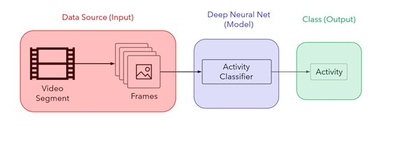
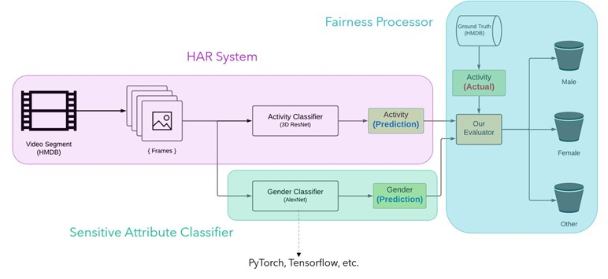

# Fairness in Human Activity Recognition

In this tutorial, we will build a system for quantifying the fairness of Human Activity Recognition models with respect to gender through the use of a gender classifier. We wil begin with a brief background on HAR systems and fairness (and why it's important to measure fairness in HAR) followed by a high-level overview of the system that we will be building. Once we have a general understanding of the system, we will jump right into building it. 

## Background
### Why Fairness?
To begin, let's first discuss the need for measuring fairness in the context of computer vision. If you do a quick google images search for "bias in computer vision", you'll see numerous examples of how bias seeps into CV systems when depoloyed into the real world (some examples below). When constructing CV systems, it's imperative that these systems perform consistently across all groups of people (e.g. race, gender, age) to prevent biased outcomes. 


### Understanding HAR
The central goal behind **Human Activity/Action Recognition** is pretty intuitive - we aim to teach computers to recognize human activities such as cooking, biking, jumping jacks, etc. The applications of this technology are plentiful: crime detection, recognizing critical health conditions, and motion-based control are just a few. 


Most HAR systems used today contain three main components: A **Data Source** (Input), an **Activity Classifier** (Model), and a **Class Prediction** (Output), where the Activity Classifier is the key component in predicting the activity. 



In the following section, we will extend this system such that it enables us to measure the fairness of the Activity Classifier with respect to gender.

## System Architecture
In order to measure HAR fairness, we need information regarding the sensitive attribute(s) of the individuals performing the activity in the input video segment (such as the person's age, gender, etc.). However, most public HAR datasets don't contain this kind of information. Our goal is to design a system that isn't dependent on the dataset to provide this kind of information to measure fairness. To achieve this, we will extend the system by adding two components - one that predicts the sensitive attribute information of the individual, the **Sensitive Attribute Classifier**, and another that computes the fairness with respect to the sensitive attribute predictions, the **Fairness Processor**. These two additional modules, along with the first module being the **HAR System** itself (as described in the previous section), make up the architecture of the system we will be implementing.



As shown above, the Sensitive Attribute Classifier contains an ANN for classifying gender as gender is the sensitive attribute we are focusing on in this tutorial. However, this framework can easily be extended to any other sensitive attribute by simply replacing the gender classifier with a classifier of the sensitive attribute being measured. The Fairness Processor takes the Activity *prediction* from the Activity Classifier, the Gender *prediction* from the Sensitive Attribute Classifier, and the Activity *actual* from the ground truth of the given dataset and passes them to a custom-built *evaluator* function that then computes the accuracy for each *class bucket*. The class buckets are simply containers for the model's accuracy for each sensitive attribute classification. The classifications provided by our gender classifier are male, female, and other each have a respective class bucket that holds their respective model accuracies. 

## Implementation
In this section, we will be modifying two repositories, [arunponnusamy/gender-detection-keras](https://github.com/arunponnusamy/gender-detection-keras) (gender classifier) and [kenshohara/3D-ResNets-PyTorch](https://github.com/kenshohara/3D-ResNets-PyTorch) (activity classifier) in order to build the above system. 

First we will modify *detect_gender.py* of **gender-detection-keras**. The final result of the modification can be found in *genderDetector.py*. We first begin by extending the existing classes [man, woman] by adding a third class, *unknown*, for when the gender classifier is unable to predict the gender of the individual in the video frame with enough confidence. 

```python
classes = ['man','woman', 'unknown']
```

Then, after calculating *conf* in line 73, we add a check to first see if the maximum confidence is above 65%. If not, we classify the frame as unknown. Otherwise, we return the class with the higher confidence.

```python
if max(norm) < 65:
    return classes[2]

elif conf[1] > conf[0]:
    return classes[1]

else:
    return classes[0]

```

Once this is added, delete the remainder of the code both inside the *for* loop as well as the remaining code after the loop terminates as it won't be needed for this tutorial. Save this modified file as *genderDetector.py* in the root directory of **3D-ResNets-PyTorch** as it will be referenced as *genderDetector* in the other modules in the repo. 

In *eval_accuracy.py* of **3D-ResNets-PyTorch**, import the newly added *genderDetector* module as *gd*.

```python
import genderDetector as gd
```


